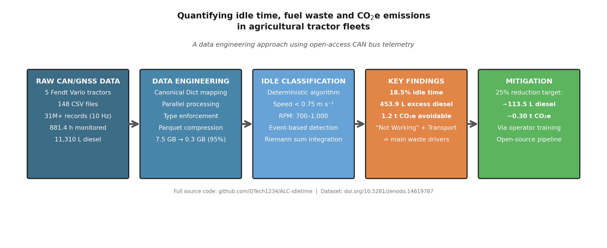

# 🚜 ALC-idletime — Agricultural Idle Time Analytics

Quantifying the potential for emission reduction and cost savings through idle time optimization in agricultural tractors, based on publicly available telemetry data.

> **Dissertation:** ABREU, Daniel. *Quantificação do Potencial de Redução de Emissões e Custos por Meio da Otimização do Tempo Ocioso de Tratores Agrícolas: Uma Análise Baseada em Dados de Telemetria de Acesso Público.* 2026. Dissertação (Mestrado Profissional em Produção Vegetal) — Instituto Federal do Triângulo Mineiro, Uberaba.

---

## Overview

This project analyzes 10 Hz CAN-bus telemetry from a fleet of five Fendt tractors to identify, classify, and quantify engine idle time — periods where the engine runs but the machine is stationary and not performing useful work. The analysis pipeline covers raw data ingestion through interactive dashboard visualization.



**Key outputs:**

- Deterministic idle classification (speed + RPM thresholds)
- Event-based state segmentation (Off / Idle / Working)
- Per-tractor and per-activity fuel waste quantification
- Financial (€) and environmental (CO₂) impact estimation
- Interactive Streamlit dashboard with map-based audit tools

---

## Repository Structure

```
ALC-idletime/
├── app/
│   ├── .streamlit/               # Streamlit config
│   ├── app.py                    # Interactive dashboard
│   └── __init__.py
├── data/
│   ├── raw/                      # Original CSV files (not tracked — see Data section)
│   ├── processed/                # Parquet files generated by notebooks
│   └── curated/                  # (optional) consolidated outputs
├── notebooks/
│   ├── 01_ingest_EDA.ipynb       # Data ingestion, cleaning, canonicalization, EDA
│   ├── 02_analysis.ipynb         # State classification, waste analysis, impact estimation
│   ├── Graphical_Abstract.png    # Graphical abstract
│   └── requirements.txt
├── requirements.txt
├── LICENSE
└── README.md
```

---

## Data

The raw telemetry data is publicly available on Zenodo:

> **DOI:** [10.5281/zenodo.14619787](https://doi.org/10.5281/zenodo.14619787)

Download the five CSV files and place them inside `data/raw/`:

| File | Tractor | Approx. Size |
|------|---------|-------------|
| `Fendt 722.csv` | Fendt 722 | 3.4 GB |
| `Fendt 314.csv` | Fendt 314 | 2.9 GB |
| `Fendt 724.csv` | Fendt 724 | 1.2 GB |
| `Fendt 820.csv` | Fendt 820 | 0.8 GB |
| `Fendt 211.csv` | Fendt 211 | 0.5 GB |

**Total: ~8.8 GB of raw data (~31 million records at 10 Hz).**

---

## Requirements

- **Python** ≥ 3.12.7
- Dependencies listed in `requirements.txt`

---

## Setup & Reproduction

### 1. Clone the repository

```bash
git clone https://github.com/DTech1234/ALC-idletime.git
cd ALC-idletime
```

### 2. Create a virtual environment (recommended)

```bash
python -m venv .venv

# Linux / macOS
source .venv/bin/activate

# Windows
.venv\Scripts\activate
```

### 3. Install dependencies

```bash
pip install -r requirements.txt
```

### 4. Download the data

Download all five CSV files from [Zenodo](https://doi.org/10.5281/zenodo.14619787) and place them in `data/raw/`.

Your folder should look like this:

```
data/
└── raw/
    ├── Fendt 211.csv
    ├── Fendt 314.csv
    ├── Fendt 722.csv
    ├── Fendt 724.csv
    └── Fendt 820.csv
```

### 5. Run the notebooks (in order)

Open and run each notebook sequentially. They are designed to be executed from the `notebooks/` directory or from the project root.

**Notebook 01 — Ingestion & EDA** (`notebooks/01_ingest_EDA.ipynb`)

- Scans `data/raw/` for CSV files
- Applies canonical column renaming (CANON dictionary)
- Converts each CSV to cleaned Parquet (chunked processing for memory safety)
- Validates outputs and runs initial exploratory analysis
- **Output:** individual `*_processed.parquet` files in `data/processed/`

> ⏱️ *This notebook processes ~8.8 GB of CSV data. Expect 10–30 minutes depending on hardware.*

**Notebook 02 — Analysis** (`notebooks/02_analysis.ipynb`)

- Consolidates all processed Parquet files
- Computes `delta_t` (time differences) and instantaneous fuel consumption
- Applies event-based state classification (Off / Idle / Working)
- Generates fleet summaries, efficiency maps, waste heatmaps
- Estimates financial (€) and CO₂ impact
- Exports `telemetry_app.parquet` for the dashboard
- **Output:** `data/processed/telemetry_app.parquet`

### 6. Launch the dashboard

From the **project root**, run:

```bash
streamlit run app/app.py
```

The app will open in your browser (default: `http://localhost:8501`).

**Dashboard features:**

- **Tab 1 — Waste Analysis:** Fleet KPIs, 3D waste concentration map (pydeck), 2D operational trail with state color-coding
- **Tab 2 — Operational Replay:** Step through the day in configurable time blocks, classify idle events as "Waste" or "Necessary Idle" on a satellite map

> 💡 *The app starts in fast mode (`DEV_FAST_MODE = True`), loading only 500k rows for quick testing. Set it to `False` in `app.py` to load the full dataset.*

---

## Idle Classification Criteria

The deterministic classifier uses the following thresholds:

| Parameter | Threshold | Rationale |
|-----------|-----------|-----------|
| Vehicle speed | < 0.75 m/s (~2.7 km/h) | Machine effectively stationary |
| Engine RPM | 700–1000 RPM | Typical idle band for Fendt engines |
| PTO speed | < 150 RPM | No active implement engagement |
| Event duration | ≥ 0 s (configurable) | Filters out brief maneuver pauses |

State assignment: **Off** (RPM < 100) → **Idle** (stationary + low RPM + PTO off) → **Working** (everything else with engine on).

---

## Key Parameters

| Constant | Value | Description |
|----------|-------|-------------|
| `DIESEL_PRICE_EUR` | 1.588 €/L | Diesel price used for cost estimation |
| `EMISSION_FACTOR` | 2.64 kg CO₂/L | IPCC emission factor for diesel |
| `DELTA_T_CUTOFF` | 300 s | Gaps > 5 min are treated as engine-off |
| `FREQ_HZ` | 10 | Telemetry sampling rate |

---

## Citation

If you use this code or methodology, please cite:

```
ABREU, Daniel. Quantificação do Potencial de Redução de Emissões e Custos por
Meio da Otimização do Tempo Ocioso de Tratores Agrícolas: Uma Análise Baseada
em Dados de Telemetria de Acesso Público. 2026. Dissertação (Mestrado Profissional
em Produção Vegetal) - Instituto Federal do Triângulo Mineiro, Uberaba.
```

---

## License

This project is licensed under the [MIT License](LICENSE).